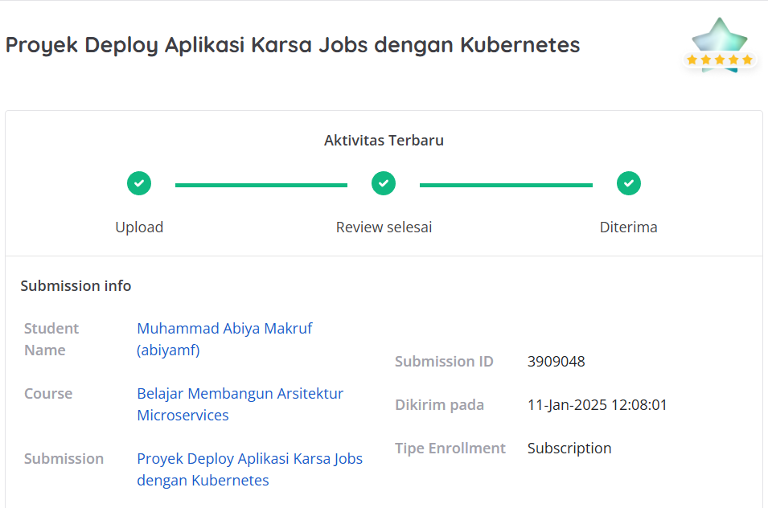

# Proyek Kedua: Dicoding-DeployAplikasiKarsaJobsdenganKubernetes
## Penilaian Proyek
Proyek ini berhasil mendapatkan bintang 5/5 pada submission dicoding course Belajar Membangun Arsitektur Microservices.



Kriteria tambahan yang saya kerjakan sehingga mendapatkan nilai terbaik:
1. Memberikan penjelasan dalam bentuk komentar untuk setiap perintah atau properti yang ada pada berkas script dan manifest.
2. Alih-alih Docker Hub, Anda menggunakan GitHub Packages (GitHub Container Registry) untuk penyimpanan image.
3. Mengimplementasikan monitoring dengan deploy Prometheus dan Grafana di Kubernetes. Silakan deploy keduanya di dalam Namespace bernama monitoring untuk mempermudah.
4. Menerapkan Continuous Integration untuk branch karsajobs dan karsajobs-ui.
    - Anda bisa menggunakan CI platform berbasis web seperti CircleCI (direkomendasikan) atau GitHub Actions. Diperbolehkan juga bila Anda ingin menggunakan Jenkins, tetapi ia harus di-deploy di Kubernetes secara lokal.
    - Ketentuan untuk branch karsajobs. CI pipeline Anda haruslah memiliki langkah-langkah sebagai berikut.
        - lint-dockerfile berisi proses untuk menginstal hadolint dan menjalankannya terhadap berkas Dockerfile.
        - test-app berisi perintah untuk menjalankan unit test untuk backend dengan perintah: go test -v -short --count=1 $(go list ./...)
        - build-app-karsajobs berisi perintah untuk build dan push image.
    - Ketentuan untuk branch karsajobs-ui. CI pipeline Anda haruslah memiliki langkah-langkah sebagai berikut. 
        - lint-dockerfile berisi proses untuk menginstal hadolint dan menjalankannya terhadap berkas Dockerfile.
        - build-app-karsajobs-ui berisi perintah untuk build dan push image.

# 🚀 Karsa Jobs - Kubernetes Deployment with CI/CD & Monitoring


Selamat datang di **Karsa Jobs**! 🎉  
Ini adalah proyek **Deploy Aplikasi Karsa Jobs** menggunakan **Kubernetes**, **CI/CD dengan GitHub Actions**, serta **Monitoring dengan Prometheus dan Grafana**.

---

## 📝 **Kesimpulan Proyek**
Proyek ini berhasil mengimplementasikan:
1. ✅ **Deployment Aplikasi Karsa Jobs** di Kubernetes menggunakan **Minikube**.
2. ✅ **CI/CD dengan GitHub Actions** untuk **backend (`karsajobs`) dan frontend (`karsajobs-ui`)**.
3. ✅ **Docker Image Management** menggunakan **GitHub Container Registry (GHCR)**.
4. ✅ **Monitoring dan Observability** dengan **Prometheus dan Grafana**.
5. ✅ **Networking dengan Service Kubernetes** untuk komunikasi antara frontend, backend, dan database MongoDB.

---

## ⚙️ **Teknologi yang Digunakan**
| Teknologi  | Deskripsi |
|------------|----------|
| 🐳 **Docker** | Containerization aplikasi backend dan frontend |
| ☨️ **Kubernetes** | Orkestrasi container menggunakan Minikube |
| 🔄 **GitHub Actions** | CI/CD untuk otomatisasi build & push image |
| 🍆 **GitHub Container Registry (GHCR)** | Tempat menyimpan Docker images |
| 📊 **Prometheus & Grafana** | Monitoring dan visualisasi performa aplikasi |
| 🌐 **NodePort & ClusterIP** | Service untuk menghubungkan frontend & backend |

---

## 🛠 **Cara Menggunakan**
Ikuti langkah-langkah berikut untuk menjalankan proyek ini di lokal menggunakan **Minikube**.

### **1 Instalasi Prasyarat**
Pastikan Anda memiliki:
- ✅ **Docker** 🐳 → [Download](https://www.docker.com/get-started/)
- ✅ **Minikube** ☨️ → [Download](https://minikube.sigs.k8s.io/docs/start/)
- ✅ **Kubectl** 🛠️ → [Download](https://kubernetes.io/docs/tasks/tools/)
- ✅ **Helm (untuk monitoring)** 📊 → [Download](https://helm.sh/docs/intro/install/)

### **2 Clone Repository**
```sh
git clone https://github.com/AbiyaMakruf/Dicoding-DeployAplikasiKarsaJobsdenganKubernetes.git
```

### **3 Jalankan Minikube**
```sh
minikube start
```

### **4 Deploy MongoDB**
```sh
kubectl apply -f kubernetes/mongodb/
```

### **5 Deploy Backend (`karsajobs`)**
```sh
kubectl apply -f kubernetes/backend/
```

### **6 Deploy Frontend (`karsajobs-ui`)**
```sh
kubectl apply -f kubernetes/frontend/
```

### **7 Cek Service dan Pods**
```sh
kubectl get svc
kubectl get pods
```

---

## 🌍 **Mengakses Aplikasi**
| Komponen | Cara Akses |
|----------|-----------|
| 🖥️ **Frontend** | `http://$(minikube ip):30020` |
| ⚙️ **Backend** | `http://$(minikube ip):30010` |
| 📦 **MongoDB** | Internal Cluster |
| 📊 **Grafana** | `http://localhost:3000` |
| 📡 **Prometheus** | `http://localhost:9090` |


Jika akses secara langsung tidak berhasil maka gunakan cara berikut:
1. Akses backend
    ```sh
    minikube service karsajobs-backend --url
    ```
    Buka alamat ip yang muncul dan pastikan menampilkan kalimat "up".
    Copy alamat ip dan ubah value env didalam file `kubernetes\frontend\karsajobs-ui-deployment.yml`.

2. Kemudian akses front-end dengan cara berikut:
    ```sh
    minikube service karsajobs-frontend --url
    ```

3. Forward port Grafana agar bisa diakses di browser
    ```sh
    kubectl port-forward -n monitoring svc/prometheus-grafana 3000:80
    ```
---

## 🚀 **CI/CD dengan GitHub Actions**
CI/CD sudah diterapkan dengan **GitHub Actions**, berikut pipeline yang berjalan:

### **🔹 Backend (`karsajobs`)**
1. 🧪 **Lint Dockerfile** → Menggunakan Hadolint
2. 🧪 **Test Backend** → `go test -v -short`
3. 🏰 **Build & Push Image** → Ke **GitHub Container Registry (GHCR)**

### **🔹 Frontend (`karsajobs-ui`)**
1. 🧪 **Lint Dockerfile** → Menggunakan Hadolint
2. 🏰 **Build & Push Image** → Ke **GitHub Container Registry (GHCR)**

Workflow ini berjalan **otomatis** saat ada push atau pull request ke branch `karsajobs` dan `karsajobs-ui`.

---

## 📊 **Monitoring dengan Prometheus & Grafana**

### **1 Tambahkan Helm Repository**
```sh
helm repo add prometheus-community https://prometheus-community.github.io/helm-charts
helm repo update
```

### **2 Deploy Prometheus & Grafana**
```sh
kubectl create namespace monitoring
helm install prometheus prometheus-community/kube-prometheus-stack --namespace monitoring
```

### **3 Akses Grafana**
```sh
kubectl port-forward -n monitoring svc/prometheus-grafana 3000:80
```
Buka **http://localhost:3000**, lalu login:
- **Username:** `admin`
- **Password:** `prom-operator`

---

## 👨‍💻 **Kontributor**
💡 **Dikembangkan oleh:**  
- [Abiya Makruf](https://github.com/abiyamakruf) 🎯

🚀 **Feel free to contribute & give a ⭐ to support this project!** 🎉

